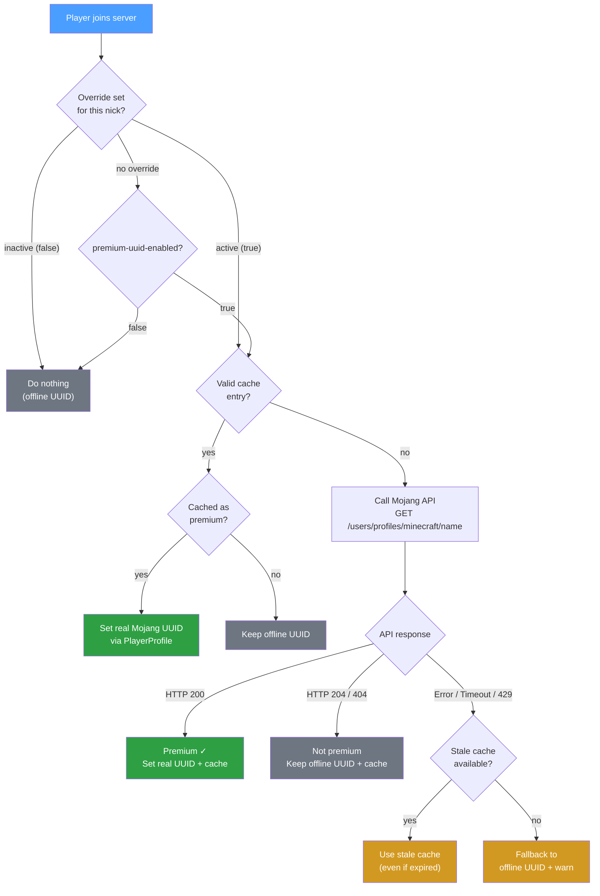

# premium-uuid

[](https://github.com/rouri404/premium-uuid/releases)
[](https://papermc.io/downloads/paper)
[](https://api.mojang.com/)
[](LICENSE) *[Ler em Português](README.pt.md)*


A lightweight Paper plugin that resolves premium (Mojang) UUIDs on `online-mode=false` servers by checking player nicknames against the Mojang API.

## Quick Start

```bash
# 1. Download the latest release
curl -LO https://github.com/rouri404/premium-uuid/releases/latest/download/PremiumUUID-1.0.1.jar

# 2. Move it to your server's plugins folder
mv PremiumUUID-*.jar /path/to/server/plugins/

# 3. Restart the server
```

That's it — the plugin works out of the box with sensible defaults. No extra configuration needed.

## Why?

On offline-mode servers, every player receives an offline UUID, which breaks account continuity for players who own Minecraft. PremiumUUID detects whether a nickname belongs to an existing premium account and, if so, assigns the real Mojang UUID — preserving inventories, stats, and permissions across sessions.

> [!CAUTION]
> **This plugin does NOT verify account ownership.** It only checks whether a nickname exists as a premium account on Mojang — it does not authenticate the player. This means a player using a pirated launcher can log in with any premium nickname and will receive that account's UUID, gaining full access to its inventory, stats, and permissions. **Use this plugin only on private, trusted servers where you know and trust every player.**

## Features

- **Automatic UUID resolution** via `AsyncPlayerPreLoginEvent` (lowest priority)
- **Persistent disk cache** (`uuid-cache.yml`) with configurable TTL
- **Per-nickname override** (`overrides.yml`) — force premium check on or off for any nick, regardless of the global toggle
- **Graceful fallback** — API failures never block login; stale cache or offline UUID is used instead
- **Admin commands** — reload config, lookup cache/override state, clear cache, set overrides
- **Zero overhead** when disabled via config

## Configuration

`plugins/PremiumUUID/config.yml`:

```yaml
premium-uuid-enabled: true

mojang-api:
  timeout-ms: 3000

cache:
  file: "uuid-cache.yml"
  ttl-minutes: 1440       # 24 hours

fallback:
  log-warning: true

logging:
  level: "INFO"            # INFO | DEBUG
```

| Key | Description | Default |
|-----|-------------|---------|
| `premium-uuid-enabled` | Master toggle for the plugin logic | `true` |
| `mojang-api.timeout-ms` | HTTP request timeout in milliseconds | `3000` |
| `cache.file` | Cache filename inside the plugin data folder | `uuid-cache.yml` |
| `cache.ttl-minutes` | Time before a cache entry is revalidated | `1440` |
| `fallback.log-warning` | Log a warning when falling back to offline UUID | `true` |
| `logging.level` | `INFO` for decisions only, `DEBUG` for API call details | `INFO` |

## Commands

Base command: `/premiumuuid` (alias: `/puuid`)  
Permission: `premiumuuid.admin` (default: op)

| Command | Description |
|---------|-------------|
| `/premiumuuid reload` | Reloads `config.yml` without restarting |
| `/premiumuuid lookup <nick>` | Shows the cached state and individual override for a player |
| `/premiumuuid clearcache [nick]` | Clears the entire UUID cache, or a single entry |
| `/premiumuuid active <nick>` | Forces premium check **on** for that nick, even if `premium-uuid-enabled: false` |
| `/premiumuuid inactive <nick>` | Forces premium check **off** for that nick, even if `premium-uuid-enabled: true` — always logs in with offline UUID, no cache or API call |

### Per-Nickname Overrides

Overrides are stored in `plugins/PremiumUUID/overrides.yml` and survive server restarts:

```yaml
overrides:
  steve: true    # always runs premium check
  alex: false    # always uses offline UUID
```

- Nick is normalised to **lowercase** before storing.
- Commands are **idempotent** — calling `active` on an already-active nick just confirms the state.
- No requirement for the player to have joined before (pre-configuration is supported).

**Precedence at login:**

1. Individual override (`overrides.yml`) — takes priority over everything.
2. Global `premium-uuid-enabled` — applies only when no override is set.

## How It Works



## Building from Source

```bash
# Requires Java 21+
./gradlew jar

# Output: build/libs/PremiumUUID-1.0.1.jar
```

## Contributing

See [CONTRIBUTING.md](CONTRIBUTING.md) for guidelines.

## License

This project is licensed under the [GNU General Public License v3.0](LICENSE).
