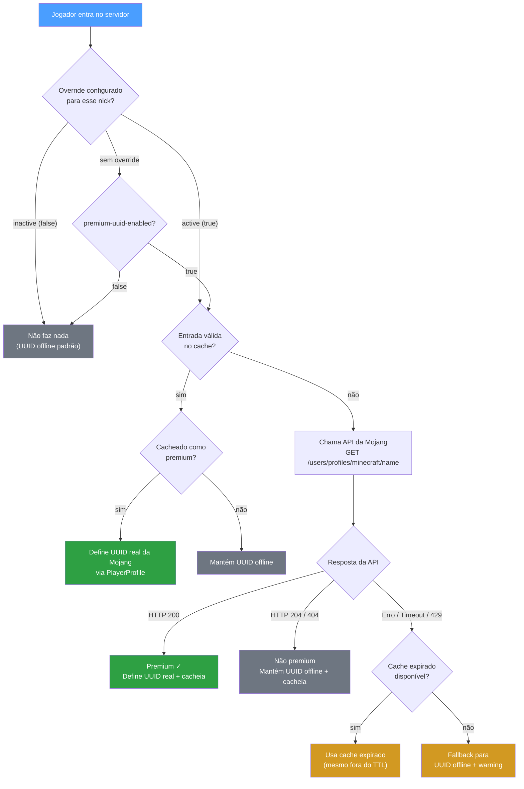

# premium-uuid

[](https://github.com/rouri404/premium-uuid/releases)
[](https://papermc.io/downloads/paper)
[](https://wiki.vg/Mojang_API)
[](LICENSE) *[Read in English](README.md)*

Um plugin leve para Paper que resolve UUIDs premium (Mojang) em servidores `online-mode=false`, checando nicknames de jogadores na API da Mojang.

## Início Rápido

```bash
# 1. Baixe a última release
curl -LO https://github.com/rouri404/premium-uuid/releases/latest/download/PremiumUUID-1.1.0.jar

# 2. Mova para a pasta plugins do servidor
mv PremiumUUID-*.jar /caminho/para/servidor/plugins/

# 3. Reinicie o servidor
```

Pronto — o plugin funciona de cara com valores padrão sensatos. Nenhuma configuração extra necessária.

## Por quê?

Em servidores offline-mode, todo jogador recebe um UUID offline, o que quebra a continuidade de conta para quem tem Minecraft original. O PremiumUUID detecta se um nickname pertence a uma conta premium existente e, se sim, atribui o UUID real da Mojang — preservando inventários, stats e permissões entre sessões.

> [!CAUTION]
> **Este plugin NÃO verifica a posse da conta.** Ele apenas checa se um nickname existe como conta premium na Mojang — não autentica o jogador. Isso significa que um jogador usando um launcher pirata pode entrar com qualquer nick premium e receberá o UUID daquela conta, tendo acesso total ao inventário, stats e permissões dela. **Use este plugin apenas em servidores privados e fechados, onde você conhece e confia em todos os jogadores.**

## Funcionalidades

- **Resolução automática de UUID** via `AsyncPlayerPreLoginEvent` (prioridade mais baixa)
- **Cache persistente em disco** (`uuid-cache.yml`) com TTL configurável
- **Override individual por nick** (`overrides.yml`) — force a checagem premium ligada ou desligada para qualquer nick, independente do toggle global
- **Fallback gracioso** — falhas na API nunca bloqueiam o login; cache expirado ou UUID offline é usado
- **Comandos administrativos** — recarregar config, consultar cache e override, limpar cache, definir overrides
- **Zero overhead** quando desabilitado via config

## Configuração

`plugins/PremiumUUID/config.yml`:

```yaml
premium-uuid-enabled: true

mojang-api:
  timeout-ms: 3000

cache:
  file: "uuid-cache.yml"
  ttl-minutes: 1440       # 24 horas

fallback:
  log-warning: true

logging:
  level: "INFO"            # INFO | DEBUG
```

| Chave | Descrição | Padrão |
|-------|-----------|--------|
| `premium-uuid-enabled` | Toggle principal da lógica do plugin | `true` |
| `mojang-api.timeout-ms` | Timeout da requisição HTTP em milissegundos | `3000` |
| `cache.file` | Nome do arquivo de cache dentro da pasta do plugin | `uuid-cache.yml` |
| `cache.ttl-minutes` | Tempo antes de uma entrada do cache ser revalidada | `1440` |
| `fallback.log-warning` | Logar warning ao cair no fallback para UUID offline | `true` |
| `logging.level` | `INFO` para decisões, `DEBUG` para detalhes das chamadas à API | `INFO` |

## Comandos

Comando base: `/premiumuuid` (alias: `/puuid`)  
Permissão: `premiumuuid.admin` (padrão: op)

| Comando | Descrição |
|---------|-----------|
| `/premiumuuid reload` | Recarrega `config.yml` sem reiniciar |
| `/premiumuuid lookup <nick>` | Mostra o estado do cache e o override individual de um jogador |
| `/premiumuuid clearcache [nick]` | Limpa o cache inteiro, ou de um nick específico |
| `/premiumuuid active <nick>` | Força a checagem premium **ligada** para esse nick, mesmo com `premium-uuid-enabled: false` |
| `/premiumuuid inactive <nick>` | Força a checagem premium **desligada** para esse nick, mesmo com `premium-uuid-enabled: true` — sempre entra com UUID offline, sem cache nem API |

### Overrides Individuais por Nick

Os overrides ficam em `plugins/PremiumUUID/overrides.yml` e sobrevivem a restarts:

```yaml
overrides:
  steve: true    # sempre roda a checagem premium
  alex: false    # sempre usa UUID offline
```

- O nick é normalizado para **minúsculas** antes de gravar.
- Os comandos são **idempotentes** — chamar `active` num nick já ativo apenas confirma o estado.
- Não exige que o jogador já tenha entrado no servidor (pré-configuração é suportada).

**Precedência no login:**

1. Override individual (`overrides.yml`) — tem prioridade sobre tudo.
2. `premium-uuid-enabled` global — aplica somente quando não há override configurado.

## Como Funciona



## Compilando do Código-Fonte

```bash
# Requer Java 21+
./gradlew jar

# Saída: build/libs/PremiumUUID-1.1.0.jar
```

## Contribuindo

Veja [CONTRIBUTING.md](CONTRIBUTING.md) para diretrizes (em inglês).

## Licença

Este projeto é licenciado sob a [GNU General Public License v3.0](LICENSE).
